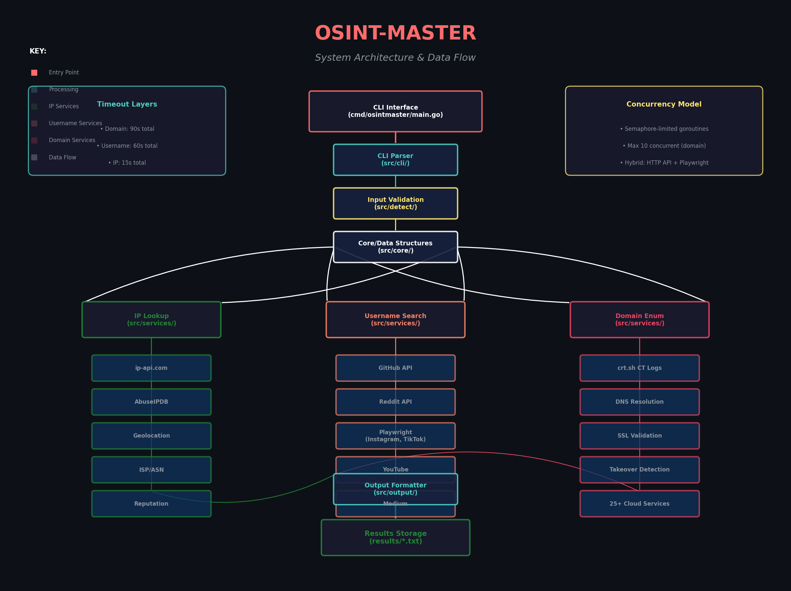

# OSINT-Master


A comprehensive Open-Source Intelligence (OSINT) tool for cybersecurity reconnaissance. This tool performs passive reconnaissance using publicly available data to identify potential vulnerabilities and security risks.

## Table of Contents

- [Overview](#overview)
- [Features](#features)
- [Prerequisites](#prerequisites)
- [Installation](#installation)
- [Configuration](#configuration)
- [Usage](#usage)
- [Output Format](#output-format)
- [Input Validation](#input-validation)
- [Custom Implementation](#custom-implementation)
- [Architecture](#architecture)
- [Testing](#testing)
- [Ethical Guidelines](#ethical-guidelines)
- [Troubleshooting](#troubleshooting)
- [Limitations](#limitations)

## Overview

OSINT-Master is a multi-functional security tool built in Go that retrieves detailed information based on:
- **IP Addresses** - Geolocation, ISP details, and abuse reputation
- **Usernames** - Social network presence across 6+ platforms
- **Domains** - Subdomain enumeration and takeover risk assessment

The tool implements **custom logic** for data gathering rather than wrapping existing OSINT CLI tools (such as `theHarvester`, `Sherlock`, or `subfinder`), demonstrating proper understanding of OSINT techniques and methodologies.

## Features

### IP Address Lookup (`-i`)
- Geolocation data (city, country, coordinates)
- ISP and ASN information
- Abuse reputation checking via AbuseIPDB
- No API key required for basic lookup (ip-api.com)

### Username Search (`-u`)
Checks presence on 6 social networks:
- **GitHub** - Public repos, followers, bio, recent activity
- **Reddit** - Karma, public description, account age
- **Instagram** - Followers, following, posts count, bio
- **TikTok** - Followers, following, likes, profile info
- **YouTube** - Subscribers, channel description
- **Medium** - Author info, follower count

Features:
- Concurrent checking for faster results
- Hybrid approach: HTTP APIs for open platforms, Playwright for JS-heavy sites
- Recent activity detection across platforms
- Profile bio and follower count extraction

### Domain Enumeration (`-d`)
- Subdomain discovery via Certificate Transparency logs (crt.sh)
- DNS resolution (IP addresses and CNAME records)
- SSL certificate validation and expiry dates
- **Subdomain takeover detection** for 25+ cloud services:
  - AWS S3, CloudFront, Azure, GitHub Pages
  - Heroku, Vercel, Netlify, Firebase
  - Shopify, WordPress.com, and more

## Prerequisites

- **Go 1.21+** - [Download](https://go.dev/dl/)
- **Playwright** - For browser automation (username search)
- **Git** - For cloning the repository

### System Requirements
- RAM: 4GB minimum (8GB recommended for concurrent browser operations)
- Disk: 500MB for tool + browser binaries
- Network: Internet connection for API calls

## Installation

### 1. Clone the Repository

```bash
git clone https://github.com/fahdaguenouz/osint-master.git
cd osint-master
```

### 2. Install Go Dependencies

```bash
go mod download
go mod tidy
```

### 3. Install Playwright Browsers

```bash
go run github.com/playwright-community/playwright-go/cmd/playwright@latest install --with-deps chromium
```

### 4. Build the Tool

```bash
go build -o osintmaster ./cmd/osintmaster
```

### 5. Create Results Directory

```bash
mkdir -p results
```

## Configuration

### Optional: AbuseIPDB API Key

For enhanced IP reputation checking, set an environment variable:

```bash
export ABUSEIPDB_API_KEY="your_api_key_here"
```

Or create a `.env` file:
```bash
ABUSEIPDB_API_KEY=your_api_key_here
```

> **Note:** The tool works without this key. Basic IP lookup uses ip-api.com (free, no key required).

## Usage

### Command Line Interface

```bash
./osintmaster --help
```

**Options:**
```
OPTIONS:
    -i  "IP Address"       Search information by IP address
    -u  "Username"         Search information by username
    -d  "Domain"           Enumerate subdomains and check for takeover risks
    -o  "FileName"         File name to save output (saved in results/ folder)
    --help                 Display this help message
```

### Examples

#### IP Address Lookup

```bash
./osintmaster -i 8.8.8.8
./osintmaster -i 8.8.8.8 -o google_dns.txt
```

**Sample Output:**
```
ISP: Google LLC
City: Mountain View
Country: United States
ASN: AS15169 Google LLC
Known Issues: No reported abuse
```

#### Username Search

```bash
./osintmaster -u "john_doe"
./osintmaster -u "@johndoe" -o user_report.txt
```

**Sample Output:**
```
Github: Found (45 followers)
  Bio: Full-stack developer | Open source enthusiast
Reddit: Found (1,234 karma)
  Bio: Tech enthusiast and gamer
Instagram: Found (1.2k followers)
Youtube: Found (5.6k subscribers)
  Bio: Tech tutorials and reviews
Tiktok: Not Found
Medium: Found
  Bio: Software engineer writing about Go and cloud architecture

Recent Activity: Active on: github, reddit, youtube
Last Post: Released new Go library for API testing on github (2024-03-15)
```

#### Domain Enumeration

```bash
./osintmaster -d example.com
./osintmaster -d "example.com" -o domain_audit.txt
```

**Sample Output:**
```
Main Domain: example.com

Subdomains found: 5
  - example.com (IP: 93.184.216.34)
    SSL Certificate: Valid until 2025-08-15
  - www.example.com (IP: 93.184.216.34)
    SSL Certificate: Valid until 2025-08-15
  - api.example.com (IP: 104.21.45.67)
    SSL Certificate: Valid until 2025-06-20
  - blog.example.com (IP: 192.0.2.1)
    SSL Certificate: Not found
  - staging.example.com (IP: unresolved)
    SSL Certificate: Not found

Potential Subdomain Takeover Risks:
  - Subdomain: staging.example.com
    CNAME record points to a non-existent AWS S3 bucket (staging-example-com.s3.amazonaws.com)
    Recommended Action: Remove or update the DNS record to prevent potential misuse

Data saved in results/domain_audit.txt
```
## Project Architecture


## Output Format

All results are saved to the `results/` directory with auto-generated filenames:
- `results/result.txt` (first run)
- `results/result2.txt` (second run)
- `results/result3.txt` (third run)
- etc.

Or specify custom filename with `-o`:
```bash
./osintmaster -d example.com -o my_scan.txt  # Saved as results/my_scan.txt
```

## Input Validation

The tool validates all inputs before processing to ensure data integrity and prevent errors:

- **IP Addresses**: Validates IPv4 format using regex patterns (e.g., `8.8.8.8`). Rejects invalid formats with clear error messages.
- **Domains**: Validates domain syntax, removes protocols (`http://`, `https://`) and `www.` prefixes automatically. Ensures valid TLD structure.
- **Usernames**: Sanitizes input by trimming whitespace and removing `@` prefix if present. Validates minimum length requirements.

Invalid inputs return descriptive errors without making unnecessary API calls.

## Custom Implementation

This tool implements **direct API integrations and custom scraping logic** rather than wrapping existing OSINT CLI tools like `theHarvester`, `Sherlock`, or `subfinder`. Key custom implementations include:

1. **Direct Certificate Transparency log parsing** from crt.sh with custom JSON decoding
2. **Custom subdomain takeover detection patterns** for 25+ cloud services using CNAME analysis and DNS resolution checks
3. **Hybrid HTTP API + Playwright browser automation architecture** with concurrent goroutine management
4. **Semaphore-limited concurrent processing** with custom timeout layers to prevent overwhelming target servers
5. **Custom input validation logic** in `src/detect/` for IP, domain, and username formats

This approach ensures full control over the reconnaissance pipeline and demonstrates understanding of underlying OSINT methodologies rather than relying on third-party tool wrappers.

## Architecture

```
osint-master/
├── cmd/osintmaster/         # Main entry point
│   └── main.go
├── src/
│   ├── cli/                   # Command-line argument parsing
│   ├── core/                  # Data structures and result types
│   ├── detect/                # Input validation (IP, username, domain)
│   ├── output/                # File output formatting
│   └── services/
│       ├── domain/            # Domain enumeration & takeover detection
│       ├── ip/                # IP geolocation & abuse checking
│       └── username/          # Social network scraping
├── results/                   # Output directory (auto-created)
├── resources/                 # Static assets
├── go.mod                     # Go module definition
├── go.sum                     # Dependency checksums
└── README.md                  # This file
```

### Key Design Decisions

1. **Concurrent Processing**: Domain enumeration uses semaphore-limited goroutines (max 25 concurrent) to prevent overwhelming target servers while maintaining speed.

2. **Hybrid Scraping**: Username search uses HTTP APIs for open platforms (GitHub, Reddit) and Playwright browser automation for JS-heavy sites (Instagram, TikTok).

3. **Timeout Management**: Multiple timeout layers prevent hanging:
   - Overall operation: 120s (domain), 60s (username), 15s (IP)
   - Per-subdomain: 4s DNS + 3s SSL
   - HTTP requests: 12-15s depending on endpoint

4. **Connection Pooling**: Shared HTTP clients and DNS resolvers reduce resource usage.

5. **Error Resilience**: Failed API calls (e.g., crt.sh 502 errors) are caught and logged as warnings without crashing the entire scan.

## Testing

### Running Tests

```bash
go run test/test.go
```

### Test Coverage

The test suite covers:
- **Input validation functions** (`src/detect/`) - IP format, domain syntax, username sanitization
- **API response parsing** - JSON decoding for crt.sh, ip-api.com, and other sources
- **Subdomain takeover pattern matching** - CNAME detection for 25+ cloud services
- **Concurrent processing limits** - Semaphore behavior and goroutine coordination
- **Error handling** - Timeout scenarios, HTTP error responses, invalid inputs


## Ethical Guidelines

> **⚠️ IMPORTANT: This tool is for educational and authorized security testing only.**

### Do's
- ✅ Use only on domains/IPs you own or have explicit permission to test
- ✅ Use for defensive security assessments and vulnerability management
- ✅ Report discovered vulnerabilities responsibly to affected parties
- ✅ Comply with local laws (GDPR, CFAA, etc.) and platform Terms of Service
- ✅ Respect rate limits and avoid excessive scanning

### Don'ts
- ❌ Use for unauthorized access or data theft
- ❌ Use for stalking, harassment, or doxxing
- ❌ Scan government or critical infrastructure without authorization
- ❌ Sell or distribute collected data
- ❌ Use to circumvent security controls

### Legal Notice
The authors assume no liability for misuse of this tool. Users are responsible for ensuring their use complies with applicable laws and regulations.

### Defensive Use
Organizations can use this tool to:
- Audit their own subdomain configurations to prevent takeover vulnerabilities
- Monitor employee username exposure across social platforms
- Check IP reputation of their infrastructure
- Identify leaked information before malicious actors do

## Troubleshooting

### Build Issues

**Error: "playwright not found"**
```bash
go run github.com/playwright-community/playwright-go/cmd/playwright@latest install
```

**Error: "missing go.sum entry"**
```bash
go mod tidy
```

### Runtime Issues

**"crt.sh enumeration failed: HTTP 502"**
- The crt.sh service occasionally experiences high load
- The tool automatically falls back to checking the main domain only
- Retry after a few minutes or use a different domain

**"Timeout reached, some subdomains may not have been analyzed"**
- Large domain lists may exceed the 120s timeout
- Increase timeout in `domain.go` if needed, or reduce the subdomain limit

**Instagram/TikTok showing "login redirect" or "limited data"**
- These platforms actively block automated access
- The tool detects this and reports partial results
- Consider manual verification for critical assessments

**"rate limit exceeded" on IP lookups**
- ip-api.com free tier: 45 requests/minute
- AbuseIPDB free tier: 1000 checks/day
- Add delays between requests if bulk scanning

### Platform-Specific Issues

**macOS: "developer cannot be verified"**
```bash
xattr -d com.apple.quarantine ./osintmaster
```

**Linux: "permission denied"**
```bash
chmod +x ./osintmaster
```

## Limitations

1. **IP Geolocation**: Accuracy varies by provider (typically city-level, not exact location)

2. **Social Networks**:
   - Platforms change layouts frequently, breaking scrapers
   - Rate limiting may require delays between requests
   - Private profiles cannot be accessed

3. **Domain Enumeration**:
   - crt.sh may not have all subdomains (relies on CT logs)
   - Wildcard DNS can produce false positives
   - Some CDNs block or rate-limit enumeration

4. **Subdomain Takeover**:
   - Detection is passive (no actual takeover attempt)
   - Some services require additional validation steps
   - False positives possible with geo-restricted services

5. **Browser Automation**:
   - Requires more resources than API calls
   - Headless browser detection is an ongoing challenge
   - Some platforms block datacenter IP ranges

## API Sources Used

| Service | Purpose | Rate Limit |
|---------|---------|------------|
| ip-api.com | IP geolocation | 45 req/min (free) |
| AbuseIPDB | IP reputation | 1000/day (free) |
| crt.sh | Certificate transparency | No limit (best effort) |
| HackerTarget | DNS enumeration | Best effort |
| Anubis | Subdomain database | Best effort |
| GitHub API | Profile/repos | 60/hour (unauthenticated) |
| Reddit API | User profiles | 100 req/min (OAuth) |

## Development

### Adding New Platforms
1. Add network definition to `src/services/username/networks.go`
2. Implement scraper in `src/services/username/[platform].go`
3. Add route in `src/services/username/checker.go`

### Contributing
1. Fork the repository
2. Create a feature branch
3. Commit your changes
4. Push to the branch
5. Create a Pull Request

## License

MIT License - See LICENSE file for details

## Acknowledgments

- [OSINT Framework](https://osintframework.com/) - Comprehensive OSINT resource collection
- [IntelTechniques](https://inteltechniques.com/) - OSINT tools and techniques
- [crt.sh](https://crt.sh/) - Certificate transparency search
- [AbuseIPDB](https://www.abuseipdb.com/) - IP reputation database

---

**Disclaimer**: This project is for educational purposes only. Ensure all activities comply with legal and ethical standards. The authors are not responsible for misuse of this tool.
